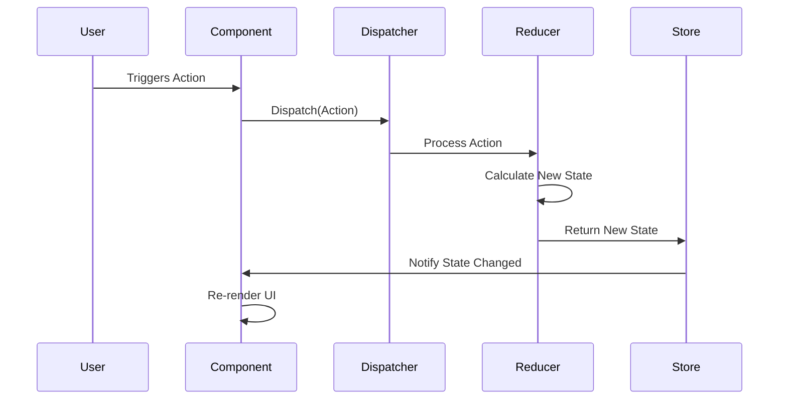

# Section 5: Flux Pattern & Fluxor Setup

> ⏱️ Estimated time: **15 minutes**

> **Recap:** In the previous section, you built the complete backend — a `ToDoRepository` for in-memory CRUD operations, SignalR and response compression services registered in `Program.cs`, the hub mapped to `/todoHub`, and Minimal API endpoints at `/api/todos` that broadcast changes via `IHubContext<TodoHub>` after every operation. You also added **SwaggerUI** and **Scalar** for interactive API documentation, available at `/swagger` and `/scalar/v1` respectively. The backend is now fully functional.
>
> ⬅️ Previous: [Section 4: Backend API](04-backend-api.md)


## Overview

Before we wire up the frontend, let's take a moment to understand the **Flux/Redux pattern** — the architectural pattern that Fluxor implements for Blazor applications. Then we'll install and configure Fluxor in our Blazor WebAssembly client project.

## The Flux/Redux Pattern

In a traditional Blazor application, components manage their own state and call `StateHasChanged()` to trigger re-renders. This works fine for simple apps, but as your application grows and multiple components need to share or react to the same data, things get messy fast — especially when real-time updates are involved.

The **Flux pattern** (and its popular variant **Redux**) solves this by enforcing a **unidirectional data flow**:

```
User Action → Dispatch Action → Reducer → New State → UI Re-renders
```



Here's how each piece works in Fluxor:

| Concept      | Fluxor Implementation                                                                       | Purpose                                                                                                           |
| ------------ | ------------------------------------------------------------------------------------------- | ----------------------------------------------------------------------------------------------------------------- |
| **State**    | A C# `record` class (e.g., `ToDoState`)                                                     | Holds the current application data. State is **immutable** — you never modify it directly.                        |
| **Action**   | A C# `record` (e.g., `AddToDoAction`)                                                       | A plain object describing the intention of what state to mutate. Think of it as a message: "add a new ToDo item." |
| **Reducer**  | A static method with `[ReducerMethod]`                                                      | A pure function that takes the current state + an action and returns a **new state**. No side effects.            |
| **Dispatch** | `IDispatcher.Dispatch(action)`                                                              | The mechanism to send an action into the system. Components dispatch actions; they never modify state directly.   |
| **Store**    | Managed by Fluxor automatically                                                             | Holds the state tree and notifies subscribers (components) when state changes.                                    |
| **Effect**   | Managed by Fluxor - after an Action has been dispatched that matches the associated Effect  | Reduce the retrieved (or generated) data into our state                                                           |

### Why does this matter for real-time apps?

With SignalR pushing updates from the server, we need a clean way to:
1. **Receive** a real-time message (e.g., "a new ToDo was added by another user")
2. **Update** the application state
3. **Re-render** the UI automatically

The Flux pattern makes this straightforward: when a SignalR message arrives, we simply **dispatch an action**. The reducer creates the new state, and Fluxor automatically notifies any components that are subscribed to that state — no manual `StateHasChanged()` calls needed.

## Step 1: Install Fluxor packages

In the `BlazinTodos.Client` project, add the Fluxor NuGet packages:

```ps1
cd BlazinTodos.Client
dotnet add package Fluxor.Blazor.Web
dotnet add package Fluxor.Blazor.Web.ReduxDevTools
```

- **Fluxor.Blazor.Web** — the core Fluxor library for Blazor
- **Fluxor.Blazor.Web.ReduxDevTools** — enables integration with the Redux DevTools browser extension for debugging state changes

## Step 2: Configure Fluxor in Program.cs

Open `Program.cs` in the `BlazinTodos.Client` project and add the Fluxor services:

```cs
// Program.cs
using Microsoft.AspNetCore.Components.WebAssembly.Hosting;
using BlazinTodos.Client.Layout;

// ⬇️ Add the using statement to get access to Fluxor
using Fluxor;
using Fluxor.Blazor.Web.ReduxDevTools;
// ⬆️

var builder = WebAssemblyHostBuilder.CreateDefault(args);

// ⬇️ Add HTTP Client to the defualt backend Web API
builder.Services.AddScoped(sp => 
	new HttpClient
	{
		BaseAddress = new Uri(builder.HostEnvironment.BaseAddress)
	});
// ⬆️

// ⬇️ Add Fluxor and Redux DevTools
builder.Services.AddFluxor(options =>
{
    options
      .ScanAssemblies(typeof(MainLayout).Assembly)
      .UseRouting() // TODO: Do we need routing?
      .UseReduxDevTools();
});
// ⬆️

await builder.Build().RunAsync();
```

Key points:
- **`ScanAssemblies`** tells Fluxor to automatically discover all State, Action, and Reducer classes in the specified assembly
- **`UseReduxDevTools()`** enables the browser extension for inspecting state changes — very helpful during development
- **`AddScoped<HttpClient>`** registers the HTTP client pointed at our backend API

## Step 3: Initialize the Fluxor Store in Routes.razor

Open `Routes.razor` in the `BlazinTodos.Client` project and add the Fluxor store initializer at the top. This ensures the Fluxor store is initialized before any components try to access state:

```xml
<!-- ⬇️ Add the Fluxor store initializer -->
<Fluxor.Blazor.Web.StoreInitializer />
<!-- ⬆️ -->

<Router AppAssembly="typeof(Program).Assembly">
    <Found Context="routeData">
        <RouteView RouteData="routeData" DefaultLayout="typeof(Layout.MainLayout)" />
        <FocusOnNavigate RouteData="routeData" Selector="h1" />
    </Found>
</Router>
```


## Step 4: Disable Server-side Pre-rendering

With the new Blazor paradigms introduced since .NET 8, pre-rendering happens on the server-side application to accelerate the inital page loading. The pre-rendering breaks the application because we do not register Fluxor on the server-side nor do we keep any state on the server-side. For our simple application we can disable WASM server-side pre-rendering completely by replacing the following snippet of code in the `BlazinTodos/Components/App.razor` file:

From:
```html
    <HeadOutlet @rendermode="InteractiveWebAssembly" />
</head>

<body>
    <Routes @rendermode="InteractiveWebAssembly" />
```

To:
```html
    <HeadOutlet @rendermode="new InteractiveWebAssemblyRenderMode(prerender: false)" />
</head>

<body>
    <Routes @rendermode="new InteractiveWebAssemblyRenderMode(prerender: false)" />
```

> Note how we allocate a new `InteractiveWebAssembltRenderMode` and setting the `prerender` argument to `false`.

## Step 5: Commit your changes

```powershell
git add .
git commit -m "Add Fluxor state management setup"
```

---

## ✅ Checkpoint

At this point you should have:

- Fluxor NuGet packages installed in the client project
- `Program.cs` configured with Fluxor services, Redux DevTools, and an HttpClient
- `Routes.razor` updated with the Fluxor store initializer
- The solution should build successfully: `dotnet build`

> 💡 If you have the Redux DevTools browser extension installed, you'll be able to see Fluxor's state tree once we add our first state and actions in the next section.

---

➡️ Next: [Section 6: Fluxor State, Actions & Reducers](06-fluxor-state-actions-reducers.md)
